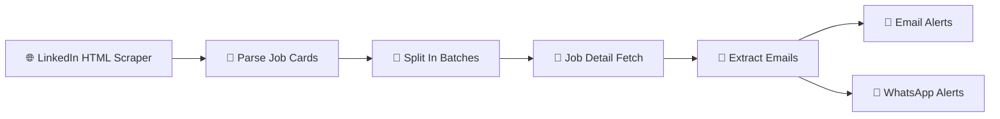

Here’s a **more premium, high-converting, visually attractive README** — optimized for **GitHub + clients + recruiters** 👇

---

# 🚀 Job Scraper Automation (n8n Workflow)

> ⚡ **Automate job discovery. Capture opportunities instantly. Get notified in real-time.**

---

## 🌐 Live Demo

🔗 **Experience the Workflow in Action:**
👉 [https://manpreet1singh2.github.io/Jobs-scrape-email-whatsapp-workflow-/](https://manpreet1singh2.github.io/Jobs-scrape-email-whatsapp-workflow-/)

---

## 📌 Overview

This project is a **production-ready automation system** built with **n8n**, designed to **scrape job listings from LinkedIn and other platforms**, process structured data, and deliver **instant alerts via Email & WhatsApp**.

💡 The goal is simple:
**Zero manual effort. Maximum opportunity capture.**

---

## ✨ Why This Project Stands Out

🚀 Eliminates manual job searching
⚡ Real-time alerts (no delays)
🧠 Smart parsing using actual LinkedIn DOM
📈 Scalable & extensible architecture
🔐 Secure & automation-first design

---

## ⚙️ Key Features

### 🔍 Intelligent Job Scraping

* Extracts jobs from LinkedIn & external sources
* Works with real HTML (no fake/mock data)

---

### 🧠 Advanced Data Extraction

Captures all critical job data:

* 🏷️ Job Title
* 🏢 Company Name
* 📍 Location
* 🔗 Job URL
* 🆔 Job ID

---

### 🧩 Smart Parsing Engine

* Built on **real LinkedIn structure**
* Optimized CSS selectors for accuracy
* Handles dynamic content reliably

---

### 📡 Real-Time Notifications

* 📧 **Email Alerts** (instant delivery)
* 📱 **WhatsApp Notifications** (high engagement)

---

### 📈 Scalable Automation

* Batch processing supported
* Easily extendable to new platforms
* Modular workflow design

---

## 🧠 Workflow Architecture



---

## 🔧 Critical Fix (Parsing Issue Solved)

The workflow initially failed due to incorrect CSS selectors.
Now updated using **real LinkedIn DOM structure** 👇

| 🔍 Field | ✅ Correct Selector                  |
| -------- | ----------------------------------- |
| Title    | `h3.base-search-card__title`        |
| Company  | `h4.base-search-card__subtitle > a` |
| Location | `span.job-search-card__location`    |
| Job Link | `a.base-card__full-link`            |
| Job ID   | `data-entity-urn`                   |

✔ Result: **Accurate extraction from real HTML**

---

## 📂 Project Structure

```
📦 Job-Scraper-Automation
 ┣ 📄 workflow.json   # n8n workflow
 ┣ 📄 README.md
```

---

## 🚀 Quick Setup

### 1️⃣ Import Workflow

* Open **n8n dashboard**
* Click **Import Workflow**
* Upload `workflow.json`

---

### 2️⃣ Configure Integrations

* 📧 Email → SMTP / Gmail API
* 📱 WhatsApp → Twilio API
* 🌐 HTTP Node → Job source URL

---

### 3️⃣ Execute

* Click **Run Workflow**
* Sit back and let automation work ⚡

---

## 📊 Sample Output

| 💼 Role             | 🏢 Company     | 📍 Location |
| ------------------- | -------------- | ----------- |
| Automation Engineer | Siemens        | Pune        |
| AI Engineer         | Intuit         | Bangalore   |
| QA Engineer         | Times of India | Delhi       |

---

## 🔐 Security & Privacy

* 🔒 No unnecessary data storage
* 🔐 Encrypted API communication
* 🏠 Supports self-hosted deployments

---

## 🧩 Tech Stack

* ⚙️ **n8n** — Workflow automation
* 🧠 **JavaScript** — Parsing logic
* 🌐 **HTTP Requests** — Scraping
* 📧 **Gmail API / SMTP**
* 📱 **WhatsApp API (Twilio)**

---

## 🎯 Use Cases

* 👨‍💻 Job Alert Systems
* 🏢 Recruitment Automation
* 📊 Lead Generation Pipelines
* 🤖 AI-based Job Matching Platforms

---

## 🚀 Roadmap

* 🤖 AI-powered job recommendations
* 📊 Analytics dashboard
* 📩 Auto-apply system
* 🔔 Telegram / Slack integrations

---

## 🤝 Contributing

Contributions are welcome!
Feel free to fork, improve, and submit PRs.

---

## ⭐ Support

If this project helped you:
⭐ Star the repository
🔁 Share with your network
🤝 Collaborate on automation projects

---

## 👨‍💻 Author

**Manpreet Singh**
🚀 Full Stack & AI Automation Developer

📧 [thenightcreww@hotmail.com](mailto:thenightcreww@hotmail.com)
🌐 [https://thenightcrew.club](https://thenightcrew.club)

---

## 💡 Final Note

> “Automation isn’t just about saving time — it’s about capturing opportunities before others even see them.”

🔥 **Built for speed. Designed for impact. Engineered for growth.**
